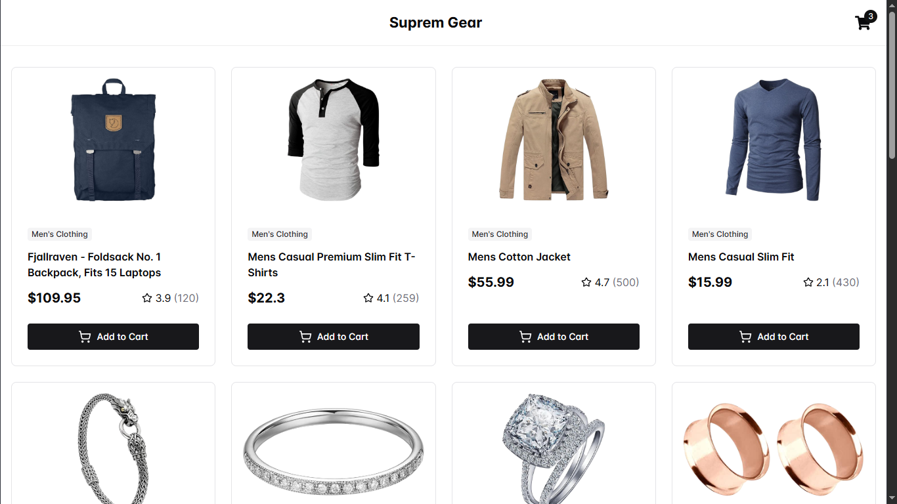
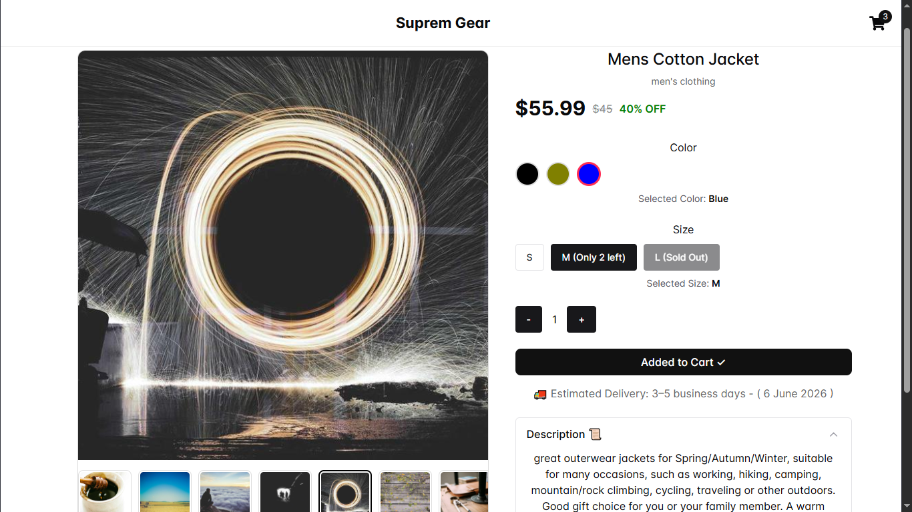
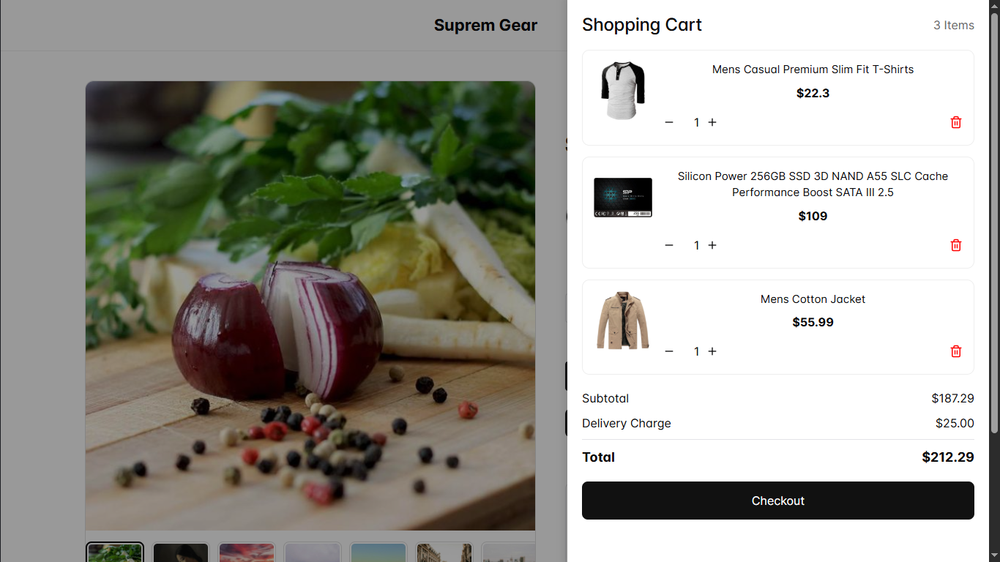

# 🛍️ E-Commerce Product Listing & Details App

A modern e-commerce frontend built with React, Vite, and Chakra UI.

## 🚀 Features

### Product Listing Page

- Display products in a responsive grid layout
- Mobile, tablet, and desktop support
- Product cards with image, title, category, and price
- Loading spinner while fetching products
  

### Product Details Page

- Product image gallery
- Thumbnail image selection
- Image zoom effect on desktop
- Product description section
- Color selection
- Size selection
- Quantity selector
- Estimated delivery date
  

### Cart Management

- Add products to cart
- Prevent duplicate products from being added
- Cart item quantity management
- Remove items from cart
- Cart drawer for quick access
- Toast notifications for cart actions
  

### Responsive Design

- Desktop: Two-column product details layout
- Mobile: Single-column layout
- Horizontal thumbnail scrolling on mobile
- Responsive product grid

### User Experience

- Loading indicators
- Toast notifications
- Smooth interactions
- Clean and modern UI

---

## 🛠️ Tech Stack

- React
- Vite
- Chakra UI
- React Icons
- React Router DOM
- React Hot Toast

---

## 📦 Installation

Clone the repository:

```bash
git clone <repository-url>
```

Navigate to the project folder:

```bash
cd project-name
```

Install dependencies:

```bash
npm install
```

Run the development server:

```bash
npm run dev
```

Build for production:

```bash
npm run build
```

Preview production build:

```bash
npm run preview
```

---

## 📁 Project Structure

```text
src/
├── components/
│   ├── ProductCard.jsx
│   ├── ProductDetailsAccordion.jsx
│   └── CartDrawer.jsx
│
├── pages/
│   ├── ProductListing.jsx
│   └── ProductDetails.jsx
│
├── routes/
│   └── AppRoutes.jsx
│
├── services/
│   └── api.js
│
├── App.jsx
└── main.jsx
```

---

## ✨ Future Improvements

- Wishlist functionality
- Product search
- Product filtering
- Product sorting
- Authentication
- Persistent cart using localStorage
- Checkout flow
- Order history
- Payment gateway integration
- Dark mode support

---

## 👨‍💻 Author

Bhavesh Kumar
